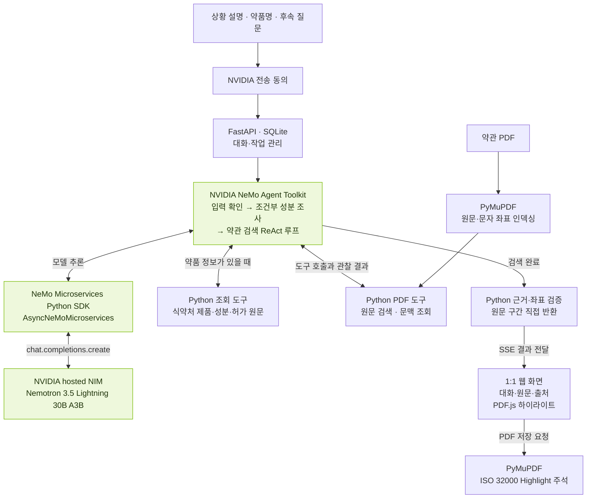

# concreteInsure

concreteInsure는 보험약관 PDF와 사용자 상황 설명으로 관련 보장 항목과 근거를 찾아 보여 주는 웹 에이전트입니다. **입력은 약관 PDF와 텍스트 설명입니다.** 약관 문구는 원문 그대로 표시하고 PDF에 형광펜 주석으로 저장합니다. **약관에 명시된 보장 항목과 성분 근거를 통한 연결**을 표시하며, 실제 가입·진단·처방·지급 조건 충족 여부는 별도 확인 대상으로 둡니다. 보험금 지급 여부나 질병을 추정하지 않습니다.

백엔드는 **Python FastAPI + NeMo Microservices Python SDK + NVIDIA NeMo Agent Toolkit(NAT)** 입니다. JavaScript는 PDF.js 웹 화면과 브라우저 검사에 사용합니다. Node.js 서버나 Node로 돌아가는 에이전트는 없습니다. 사용자 접점은 웹이며 NemoClaw와 파인튜닝은 포함하지 않습니다.

## 사용자 입력부터 NVIDIA 연동까지

기본 웹 흐름은 약관 PDF와 상황 설명으로 시작합니다. PDF의 원문·문자 좌표는 로컬에서 추출하고, 검색마다 전송 동의를 받은 뒤 NAT 워크플로가 필요한 NVIDIA 추론과 도구 실행을 연결합니다.



NAT 안의 모델 호출은 공통 NeMo Microservices SDK를 통해 hosted NIM으로 전달됩니다. 입력 추출은 구조화 JSON을, 성분 에이전트와 ReAct 검색은 함수 도구 호출을 사용합니다. 성분 조사는 NAT 내장 에이전트이고, 약관 검색은 등록된 NAT 워크플로 안의 자체 ReAct 루프입니다. 제품 후보가 나오면 사용자가 함량·제형을 선택하고 전송에 다시 동의합니다. 입력과 후보를 저장해 두므로 입력 분석부터 반복하지 않고 성분 조사부터 재개합니다. 진행 상태와 결과는 SSE로 전달합니다.

| 기술 | 현재 구현에서의 역할 |
|---|---|
| Nemotron `nvidia/nemotron-3.5-lightning-30b-a3b` | 기본 추론 모델. 명시 정보 추출 및 허용 도구·ID 선택 |
| NVIDIA hosted NIM | `https://integrate.api.nvidia.com/v1` 모델 추론 엔드포인트 |
| NVIDIA NeMo Agent Toolkit `nvidia-nat[langchain]==1.9.0` | 모든 조사 워크플로 실행, 조건부 `tool_calling_agent`와 `medicine` Function Group 등록 |
| NeMo Microservices Python SDK `nemo-microservices==1.5.0` | `AsyncNeMoMicroservices.chat.completions.create`로 NIM 호출 |
| skills.sh 호환 `SKILL.md`·Python CLI | 도구 사용 지침과 개별 실행 인터페이스. 웹에서는 같은 Python 모듈을 직접 호출 |
| FastAPI·Pydantic·SQLite·SSE | 요청 검증, 대화·작업·선택 대기 저장, 진행 상태와 결과 전달 |
| PyMuPDF·PDF.js | 원문 구간·문자 좌표 추적, 브라우저 표시, 표준 Highlight 주석 저장 |

**LLM이 작성한 최종 문장은 결과에 사용하지 않습니다.** 애플리케이션이 원문 구간과 근거 ID를 검증해 직접 반환하며 질병·실제 보험금 지급 여부를 추정하지 않습니다. 식약처 조회는 실시간 공식 API를 사용하는 별도 Python 도구이며 NIM이 성분 정보를 생성하는 구조가 아닙니다. 사용자 상황·관련 대화·검색 후보·약관 발췌문은 동의 후 추론에 사용될 수 있습니다.

SkillSpector는 개발 단계의 스킬 정적 검사 도구입니다. NemoClaw·OpenShell 실행 환경, 별도 NeMo Guardrails 서비스, 파인튜닝은 현재 런타임에 포함하지 않습니다.

## 실행

Python 3.12 또는 3.13, [uv](https://docs.astral.sh/uv/), Node.js 22.13 이상이 필요합니다. Node/npm은 PDF.js 정적 파일 설치와 브라우저 검사 도구용입니다.

저장소를 복제하고 의존성과 커밋 전 검사 훅을 설치합니다.

```sh
git clone https://github.com/tongnamuu/concrete-insure.git
cd concrete-insure
uv sync --extra dev --locked
uv run python scripts/install-git-hooks.py
npm ci
```

프로젝트 루트에 `.env`가 없을 때만 예시 파일을 복사합니다. 기존 `.env`는 유지합니다.

```sh
if [ ! -e .env ]; then
  cp .env.example .env
fi
```

`.env`에 `NVIDIA_API_KEY`를 입력하세요. 약품명으로 성분을 조회하려면 아래 **식약처 API 활용 신청과 키 발급** 안내에 따라 `MFDS_API_KEY`도 설정합니다. 키를 설정한 뒤 서버를 실행합니다.

```sh
uv run concrete-insure
```

브라우저에서 http://127.0.0.1:8000 을 엽니다. `npm start`도 같은 Python 서버를 실행합니다. 한 프로젝트의 데이터 디렉터리에는 서버를 하나만 실행하세요.

`.env`의 `NVIDIA_API_KEY`만 설정하면 기본 Nemotron 모델을 사용할 수 있습니다. 기본값은 `nvidia/nemotron-3.5-lightning-30b-a3b`입니다. 키가 없으면 조사를 시작할 수 없고 설정 필요 상태를 표시합니다. 검색 버튼을 누르면 전송 동의문만 표시됩니다. 매번 체크 후 진행해야 요청을 전송하며, 취소·미동의 시 새 작업이나 결과를 만들지 않습니다. 모든 조사는 NAT와 Nemotron NIM을 거칩니다. 허용된 재시도까지 실패하거나 잘못된 도구 응답을 받으면 실패로 알립니다.

기본 사용 흐름은 **텍스트 레이어가 있는 약관 PDF + 상황 설명**입니다. 직접 발급받아 입력할 키는 다음 두 가지입니다.

| API 키 | 사용 조건 |
|---|---|
| `NVIDIA_API_KEY` | **모든 검색에 필수.** Nemotron NIM 추론에 사용 |
| `MFDS_API_KEY` | **의약품·성분 조회에 필수.** 약품명 없는 일반 약관 검색에는 불필요. 아래 활용 신청·키 발급 안내 참고 |

`NIM_BASE_URL`과 `NIM_MODEL`은 예시 파일의 기본값을 그대로 사용하면 됩니다. `NEMO_MICROSERVICES_BASE_URL`은 별도 NeMo 플랫폼을 배포한 경우에만 설정하며 기본 hosted NIM 추론에는 필요하지 않습니다.

NeMo Microservices SDK는 서비스에 접속하는 클라이언트입니다. SDK 설치만으로 Guardrails·Evaluator·Customizer 서비스가 배포되지는 않습니다. 현재 SDK로 실행하는 기능은 **NIM 추론**이며, 별도 NeMo Guardrails Microservice를 사용했다고 표시하지 않습니다. 원문·검색어·좌표 검증은 애플리케이션에서 항상 수행합니다.

## 식약처 API 활용 신청과 키 발급

약품명에서 성분·허가문서를 확인하려면 **NVIDIA 키와 별도로 식약처 API 키를 발급받아야 합니다.** 제품별 내장 자료나 키 없는 데모 데이터로 대체하지 않습니다. 약품명이 없는 일반 약관 검색에는 식약처 키가 필요하지 않습니다.

1. [공공데이터포털의 식품의약품안전처_의약품 제품 허가정보](https://www.data.go.kr/data/15095677/openapi.do)에 로그인하고 **활용신청**을 합니다.
2. 해당 서비스의 활용 승인을 확인한 뒤 **일반 인증키(Decoding)**를 확인합니다. 다른 식약처 서비스에만 승인된 키로는 이 서비스를 호출하지 못할 수 있습니다.
3. 프로젝트의 `.env`에 `MFDS_API_KEY=발급받은키`를 설정합니다. 키는 Git에 추가하지 않습니다. 기존 `.env`를 예시 파일로 덮어쓰지 않습니다.
4. 실행 중인 서버를 종료하고 `uv run concrete-insure`로 다시 시작합니다. 서버는 시작할 때 환경변수를 읽습니다.
5. 화면의 **상표명으로 공식 성분 확인 → 제품 찾기**로 조회를 확인합니다. 설정 여부와 실제 서비스 인증 성공은 별개입니다.

사용하는 서비스는 `DrugPrdtPrmsnInfoService08`입니다. `getDrugPrdtPrmsnInq08`로 제품 후보를 찾고, 사용자가 품목을 선택하면 `getDrugPrdtPrmsnDtlInq08`로 성분·효능효과·주의사항 원문을 조회합니다. 주성분 필드가 없을 때만 `getDrugPrdtMcpnDtlInq08`로 보완합니다. 키는 이 공식 API에만 전송하고 콘솔·화면에 출력하지 않습니다.

설명에서 약품명이 추출되면 대화 안에 제품 후보를 표시합니다. 함량·제형을 선택하고 **선택한 제품으로 계속**을 누른 뒤 NVIDIA 전송에 다시 동의하면 성분 조사부터 이어집니다. 질문을 다시 입력하지 않으며, 완료된 입력 분석과 제품 후보 조회를 반복하지 않습니다. 후보가 없거나 조회에 실패해도 성분·보장 여부를 추정하지 않습니다. 최신 상세정보는 매 검색마다 조회하며 조회 시각과 문서 변경일을 표시합니다. 현재 허가정보만으로 처방 당시 허가사항을 확정하지 않습니다.

## 조건부 성분 근거 에이전트

NAT 워크플로 안에 `drug_evidence_agent`를 별도 함수로 등록하고 NVIDIA NAT의 내장 `tool_calling_agent`로 실행합니다. `nvidia-nat[langchain]` 의존성은 `uv sync --extra dev`로 함께 설치됩니다. 모델은 기존 NeMo Microservices SDK의 Nemotron 연결을 사용하므로 추가 키는 필요하지 않습니다.

- 사용자가 명시한 약품명이 입력 확인 단계에서 추출되거나, 사용자가 공식 품목을 선택한 경우에만 호출합니다. 약품명은 현재 입력·확인 항목 또는 관련된 이전 사용자 발화에 근거해야 합니다. 약관에만 있는 약품명은 호출 근거가 아닙니다.
- 약품 정보 없는 사고 설명·질병 질문은 성분 에이전트와 식약처 호출을 건너뛰고 약관 검색으로 진행합니다. 이 경우 식약처 키도 요구하지 않습니다.
- 미선택 약품명은 제품 후보를 조회하고 사용자 선택을 기다립니다. 이미 선택한 품목은 성분과 원문 허가문서를 확인합니다. 후보를 모델이 대신 선택할 수 없습니다.
- 에이전트는 `drug-ingredient-resolver` 스킬 지침과 NAT `medicine` Function Group의 조회·성분·설명서·근거 확정 도구를 사용합니다. 관찰 결과를 받은 뒤 다음 도구를 선택하며, 근거 확정 도구가 성공하면 추가 답변 생성 없이 종료합니다.
- 도구는 요청에 허용된 ID만 받고 중복 호출·필수 근거 누락을 차단합니다. 최대 12회 모델 단계, 기존 호출당 5분·재시도 1회·전체 20분 상한을 적용합니다. 성분명·원문·근거 연결은 코드가 검증하며 모델의 최종 문장은 사용하지 않습니다.

성분 조사는 NAT 내장 에이전트이며, 약관 검색은 현재 NAT 상위 워크플로 내부의 자체 ReAct 루프입니다. PDF 처리·원문 검증·주석 생성은 결정적인 Python 도구입니다. 콘솔에서 `agent.routed`의 `invoke`/`skip`, `agent.tool`, `agent.completed`로 분기와 실행 단계를 확인할 수 있습니다. 사용자 설명·약품명·허가문서 본문은 로그에 남기지 않습니다.

## 사용 흐름

1. 보험약관 PDF를 업로드합니다. 샘플 자료 없이 본인 파일로 동작합니다.
2. 하나의 대화 입력창에 사고 경위·진료 상황이나 질문을 적고 **보내기**를 누릅니다. 처방 자료 없이 설명만 있어도 진행하며, 사용자 진술을 확인된 진단으로 취급하지 않습니다. 답변을 확인한 뒤 후속 질문을 이어갈 수 있습니다.
3. 약품명이 있으면 식약처 API에서 제품 후보를 찾습니다. 정확한 함량·제형을 선택하고 **선택한 제품으로 계속**을 누르면 해당 품목의 성분·허가문서 원문으로 약관 표현을 연결합니다. 제품별 정적 자료를 사용하지 않습니다.
4. 관련 특약·지급사유·정의·제외사항·청구서류를 원문으로 확인합니다. 위치 버튼으로 PDF를 이동하고, 표시된 PDF를 저장하면 표준 Highlight 주석이 포함됩니다.
5. **새로고침해도 현재 탭의 약관·제출한 질문·검색 결과·제품 선택 대기를 복원합니다.** 진행 중인 요청은 같은 작업 ID로 SSE에 다시 연결하며, 이미 접수한 검색을 다시 보내지 않습니다. 아직 보내지 않은 입력은 저장하지 않습니다. **새 대화**는 약관을 유지하고 이전 맥락·입력·선택 항목을 초기화합니다. 다른 상황이나 다른 사람의 자료는 새 대화로 시작하세요. 약관 교체도 이전 대화와 연결을 끊습니다. **자료 삭제**는 원본과 모든 저장된 대화·결과를 삭제합니다.

**세션 기준:** 현재는 사용자 한 명이 같은 화면에서 작업하는 흐름을 전제로 합니다. 새로고침·질문 추가·제품 선택·실패 후 재시도·SSE 재연결은 기존 대화 ID(`conversationId`)를 유지합니다. 검색 실행 ID(`jobId`)가 달라져도 새 대화로 취급하지 않습니다. **자료 삭제(자료 클리어)**를 완료하면 이전 자료와 대화 맥락을 삭제하며, 다음 업로드·첫 질문에서 새 자료 ID와 대화 ID를 만듭니다. 삭제 확인을 취소하면 기존 대화를 유지합니다. 명시적인 **새 대화**와 약관 교체는 앞서 설명한 대로 이전 맥락을 분리합니다. 브라우저 소유권 쿠키는 대화의 연속 여부를 판단하는 ID가 아닙니다.

시연에는 실제 환자의 처방 자료가 필요하지 않습니다. 사용할 약관 PDF를 올린 뒤 가상의 상황을 텍스트로 입력하세요. 결과는 업로드한 약관과 실시간 API 응답에 따라 달라집니다. 약품명이 없는 사고 상황도 설명만으로 검색할 수 있습니다. 자동 테스트는 합성 PDF와 `tests/fixtures/`의 테스트 응답을 사용합니다.

제품 선택 대기는 질문·검증된 검색어·이전 대화 맥락·후보와 함께 서버에 저장합니다. 새로고침하거나 재개가 실패·취소된 뒤에도 선택 대기를 복원하고 입력 분석부터 반복하지 않고 이어갈 수 있습니다. 선택한 제품으로 계속 진행할 때는 새로 전송 동의를 받습니다. 선택한 제품의 상세정보는 새로 조회합니다. 새 질문을 보내거나 새 대화·다른 약관으로 바꾸면 이전 선택 대기는 이어갈 수 없습니다. 같은 재개 요청을 중복 전송해도 실행 중이거나 완료된 작업을 다시 만들지 않습니다.

대화는 서버의 SQLite에 저장하며 최근 성공한 메시지 최대 4개와 확인한 원문 일부를 후속 질문의 맥락으로 사용합니다. 과거 질문·원문도 NVIDIA로 다시 전송됨을 매번 동의문에 알립니다. 실패·취소된 메시지는 제외합니다. 원문 인용은 매번 현재 PDF에서 다시 검색·검증하며 자유롭게 생성한 답변이나 지급 판단은 표시하지 않습니다. 맥락에서 대상을 특정할 수 없으면 구체적인 정보를 요청합니다. 이전 버전의 단발 검색 결과는 대화로 자동 편입하지 않습니다.

검색 실패나 약 이름의 부재를 보장 제외로 해석하지 않습니다. 성분의 염·제형을 임의로 통합하거나 약품에서 질병을 추정하지 않습니다.

## 모듈과 실행 규약

입출력은 [contracts.md](docs/contracts.md), 책임은 [module-definition.md](docs/module-definition.md)에 정의합니다.

| Python 모듈 | 책임 |
|---|---|
| `concreteinsure/server.py`, `store.py` | 업로드·소유권·SQLite·작업 취소·재연결 가능한 SSE |
| `conversation.py` | 서버에 저장된 성공 대화와 원문을 제한된 길이의 모델 맥락으로 구성 |
| `providers.py` | 실제 `AsyncNeMoMicroservices` SDK 추론, 식약처 조회 |
| `nat.py` | 등록된 NAT workflow에서 Python 에이전트를 직접 실행 |
| `agent.py`, `agents/` | 명시 정보 추출 → 제품 근거 → ReAct 검색/문맥 → 보장 항목 연결 → 원문 검증 |
| `pdf.py`, `python/pdf_worker.py` | 제한 시간·취소가 있는 별도 프로세스, 문자 좌표 추적, 원문 검증, 표준 주석 |
| `skills_cli.py`, `skills/` | 세 도구의 JSON 입출력 CLI와 skills.sh 호환 지침 |
| `public/` | 1:1 split PDF.js 화면 |

ReAct의 모델 출력은 허용된 도구와 ID를 고르는 데만 사용합니다. 자유롭게 생성한 최종 답변은 폐기하고, 애플리케이션이 PDF의 source span을 직접 반환합니다. 검색과 인용은 원문 언어로 처리합니다. 원문 계산·주석 같은 결정적인 작업에는 모델을 사용하지 않습니다. 의약품 근거는 식약처 구조화 성분 필드와 설명서의 명시적 문장에서만 추출합니다. 현재 성분 연결 파서는 명시적인 전구약물→활성 대사물 전환 표현을 지원하며, 표현을 인식하지 못하면 임의로 성분명을 줄이거나 같은 성분이라고 추정하지 않습니다.

## 스킬과 테스트

웹의 성분 에이전트와 CLI 스킬은 같은 식약처 제공자와 원문 검증 모듈을 사용합니다. CLI는 개별 도구 어댑터이며 에이전트 실행 경로는 웹의 NAT 워크플로입니다. 웹이 매번 별도 CLI 프로세스를 실행하는 구조는 아닙니다. 두 도구 스킬은 `drug-ingredient-resolver`, `pdf-iso32000-annotator`이며 각 `SKILL.md`에 JSON 입출력과 사용법이 있습니다. 상위 원문 규칙은 `concrete-insure-source`입니다.

```sh
uv run --extra dev pytest -q
npm run test:browser
npm run test:browser:coverage
npm run test:browser:consent
npm run test:browser:progress
npm run test:browser:conversation
npm run test:browser:reset
npx skills@1.7.0 add . --list
# SkillSpector를 별도 설치한 경우:
sh scripts/scan-skills.sh
```

의약품·성분·허가문서의 정적 JSON은 `tests/fixtures/`에만 두며, 테스트 제공자(`tests/mfds_fixture.py`)가 주입하는 합성 응답으로만 사용합니다. 운영 서버·에이전트·스킬에서는 불러오지 않으며 키 누락이나 API 실패 시 대체 자료로 사용하지 않습니다.

브라우저 검사는 자체 임시 저장소와 합성 PDF를 사용합니다. 시스템 Chromium을 쓰려면 `BROWSER_EXECUTABLE`을 지정하세요. 없으면 `npx playwright install chromium`으로 설치합니다. [검증 기록](docs/validation.md)에 실제 실행 결과와 미검증 기능을 구분합니다.

## 프로젝트 이름과 기존 설치 업데이트

| 구분 | 이름 |
|---|---|
| 서비스·화면 | `concreteInsure` |
| GitHub 저장소·패키지·서버 실행 명령 | `concrete-insure` |
| Python 모듈·NAT 진입점 | `concreteinsure` |
| 스킬 CLI | `concreteinsure-skill` |

이전 이름으로 설치한 작업 폴더에서는 서버를 종료한 뒤, 프로젝트 루트에 남은 자동 생성 메타데이터 `insure_lens.egg-info/` 폴더를 삭제하고 `uv sync --extra dev --locked`를 실행하세요. 오래된 NAT 진입점이 함께 검색되는 것을 방지합니다. 기존 `.env`를 유지한 채 `uv run concrete-insure`로 다시 시작합니다. 새로 복제한 저장소에는 이 정리가 필요하지 않습니다.

## 실행 로그와 코드 리뷰

웹 서버의 실행 로그는 서버를 실행한 터미널의 표준 오류(`stderr`)에 JSON 한 줄씩 출력합니다. 로그 파일은 생성하거나 저장하지 않으며 추가 환경변수 설정도 필요 없습니다. 요청·작업 ID로 처리 단계와 NVIDIA/PDF 소요 시간, 실패·취소를 확인할 수 있습니다. 사용자 입력·약관 원문·키·개인 경로는 기록하지 않습니다. [로깅 지침](docs/logging.md)을 따릅니다.

코드 변경은 작업 브랜치에서 검증 후 PR로 제출합니다. 변경 내용과 테스트 결과를 PR에서 확인하고 병합 여부를 결정합니다. 작업 규칙은 [AGENTS.md](AGENTS.md)에 기록했습니다.

저장소를 복제한 뒤 위 설치 명령으로 Git 훅을 반드시 설정합니다. 설정 후 `git commit` 직전에 **커밋에 포함될 전체 파일과 파일명**을 검사하고 개인 경로가 있거나 검사를 실행할 수 없으면 커밋을 차단합니다. 작업 폴더에서만 지우고 다시 스테이징하지 않은 경로도 차단합니다. macOS·Linux·Windows 홈 경로와 macOS 개인 임시 경로, URL 인코딩·UTF-16·심볼릭 링크 대상도 검사하며 발견한 경로 자체는 출력하지 않습니다.

수동 점검은 `uv run python scripts/check-personal-paths.py`로 실행합니다. `--no-verify`나 훅 설정 해제로 검사를 우회하지 않습니다. 로컬 Git 설정은 복제 시 전달되지 않으므로 새 복제본마다 설치해야 하며, GitHub PR·푸시에서도 같은 검사를 다시 실행합니다. 경로 패턴으로 식별할 수 없는 사용자 지정 경로는 리뷰에서도 확인합니다.

## 지원 범위

- 약관: 20MiB·1000쪽·200만 문자. 원문을 보장하기 위해 텍스트 레이어 없는 약관은 거절합니다.
- 첫 검색어 추출과 이후 Nemotron NIM 호출은 **시도당 최대 5분(300초)**입니다. 시간 초과·연결 오류·일시적인 서버 오류(5xx)는 1초 후 **1회만 재시도**하므로 한 호출은 최대 약 10분 걸릴 수 있습니다. 인증·모델 설정·형식/검증 오류는 재시도하지 않습니다. 재시도는 실패한 모델 요청만 반복하며 이미 끝난 PDF 검색이나 식약처 조회를 다시 실행하지 않습니다. SDK 내부 재시도는 꺼서 시도가 중첩되지 않게 합니다. 전체 NAT 조사는 20분 상한이며, 이 상한이나 사용자 취소에 도달하면 진행 중 호출·재시도 대기도 취소됩니다. SSE는 5초마다 현재 단계와 경과 시간을 전달하고 콘솔에는 시도 번호와 재시도 사유를 기록합니다. 로컬 대체 결과는 만들지 않습니다.
- PDF 작업은 기본 120초이며 취소 시 프로세스를 종료합니다. 긴 요청은 작업 ID를 반환하고 SSE로 완료를 알립니다.
- `.local-data`의 SQLite·업로드 사본·인덱스에 약관·대화·작업·이벤트·선택 대기를 저장합니다. 브라우저에는 탭별 자료 ID만 `sessionStorage`에 저장하고, 새로고침 시 소유권을 확인한 뒤 서버 자료를 복원합니다. 복원 실패 시 ID와 자료를 보존하고 **대화 다시 불러오기**를 표시합니다. 자료가 이미 삭제됐거나 접근할 수 없으면 빈 화면으로 시작합니다. 서버가 계속 실행 중이면 대기·진행 중인 요청도 이어서 확인할 수 있습니다. **서버 재시작으로 중단된 실행을 자동으로 재실행하지는 않습니다.** 완료 결과는 유지하고 중단 상태를 표시합니다. 자료 삭제는 업로드 사본과 관련 기록을 지우며, 다운로드한 파일과 사용자가 업로드한 원본 파일은 건드리지 않습니다. 탭을 닫은 뒤 재접속까지 보장하는 계정별 대화 목록은 제공하지 않습니다.
- 로컬 단일 사용자 데모입니다. 서비스 배포용 계정 인증·암호화·보관 기한·분산 큐는 별도입니다.
- 원문은 PDF text layer에서 추출한 동일 Unicode 구간이며 추출 줄바꿈을 포함합니다. 전체 약관의 모든 관련 문구를 찾았다는 보장은 하지 않습니다. 지원하지 않는 조항 형식은 미확인 상태로 남습니다.
- ISO 32000의 Highlight/QuadPoints/Contents/AP 주석을 사용합니다. 전체 표준 적합성 인증을 의미하지 않으며 원본은 보존합니다. PyMuPDF는 AGPL/상용 이중 라이선스입니다.
- [OpenShell](integrations/openshell/README.md)은 선택적 정책 예제만 제공하며 현재 실행 환경에 적용됐다고 주장하지 않습니다. 범용 `build.nvidia.com Skill API`는 확인된 규약이 없어 임의로 만들지 않았습니다.

NVIDIA 연결과 공식 출처는 [nvidia-stack.md](docs/nvidia-stack.md)를 참고하세요.
