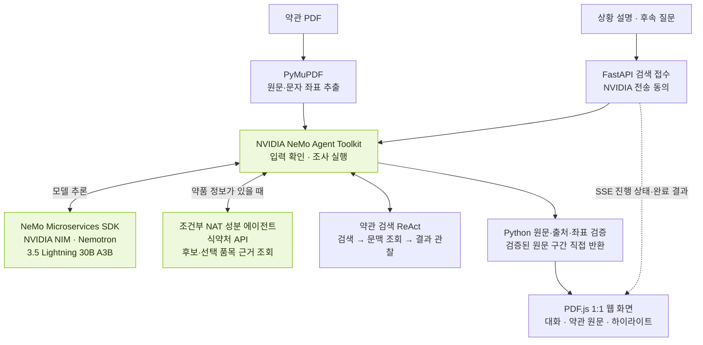

# concreteInsure

보험약관 PDF와 사용자 상황 설명으로 관련 조항과 약품 성분 근거를 찾아주는 웹 에이전트입니다. 약관에 명시된 보장 항목과 근거의 연결을 보여 주며, **약관 문구는 요약하거나 바꾸지 않고 원문 그대로 표시합니다.**

## 사용자 흐름

1. **약관 업로드**: 텍스트 레이어가 있는 보험약관 PDF를 올립니다.
2. **상황 설명**: 사고·진료 상황이나 질문을 입력하고 NVIDIA 전송에 동의합니다.
3. **약품 확인**: 약품명이 있으면 식약처 공식 제품 후보에서 함량·제형을 선택합니다. 다시 전송에 동의하면 완료된 입력 분석을 반복하지 않고 성분 조사부터 이어갑니다. 약품 정보가 없는 질문은 바로 약관 검색으로 진행합니다.
4. **원문 확인**: 관련 특약·지급사유·정의·제외사항 등을 원문으로 확인합니다. 검색 결과를 누르면 우측 PDF의 해당 문구로 이동해 하이라이트합니다.
5. **추가 확인·저장**: 후속 질문을 이어가거나 Highlight 주석이 포함된 PDF를 저장합니다.

검색 진행 상태를 화면에서 확인할 수 있으며, **같은 탭에서 새로고침해도 제출한 질문·결과·제품 선택 대기를 복원합니다.** 새 대화는 약관을 유지하고 대화 맥락을 초기화하며, 자료 삭제는 업로드 사본과 저장된 대화·결과를 지웁니다.

## 핵심 기술 스택

- **NVIDIA Nemotron 3.5 Lightning 30B A3B** (`nvidia/nemotron-3.5-lightning-30b-a3b`): 명시된 검색어·약품명을 추출하고 에이전트가 실행할 도구와 조회 대상을 선택합니다. 추출한 정보가 실제 입력에 있는지는 코드가 검증합니다.
- **NVIDIA NIM·NeMo Microservices Python SDK 1.5.0**: NIM이 Nemotron 추론을 제공하고, Python SDK가 요청과 응답을 연결합니다. 구조화 JSON과 함수 도구 호출을 사용합니다.
- **NVIDIA NeMo Agent Toolkit 1.9.0·ReAct** (`nvidia-nat[langchain]`): 전체 조사 워크플로를 실행합니다. 약품 정보가 있을 때만 내장 `tool_calling_agent`로 성분을 조사하고, 필수 근거가 모이면 코드가 추가 추론 없이 성분 조사를 종료합니다. 약관 검색은 워크플로 내부의 ReAct 루프로 검색·문맥 조회를 이어갑니다.
- **skills.sh 호환 Agent Skills·식약처 API**: `SKILL.md`로 성분 조회와 PDF 검색·주석 도구의 사용 규칙을 정의합니다. 식약처 공식 API에서 사용자가 선택한 품목의 성분과 허가문서를 함께 확인해 약관과 연결할 근거를 확보합니다.
- **Python·FastAPI·SQLite·SSE**: PDF 업로드와 검색 요청을 처리하고 대화·작업 상태를 저장합니다. 진행 상황과 완료 결과를 전달하며, 새로고침 후 기존 작업에 재연결합니다.
- **PyMuPDF·PDF.js**: PDF 원문과 문자 좌표를 추출하고, 좌측 대화·우측 약관의 1:1 화면에서 원문과 하이라이트를 표시합니다. ISO 32000의 표준 Highlight 주석이 포함된 PDF를 생성합니다.

## 사용자 입력부터 NVIDIA 연동까지

모델은 검색과 도구 실행을 제어합니다. **사용자에게 보여 줄 인용문과 하이라이트 좌표는 애플리케이션이 PDF에서 직접 가져와 검증하며, 모델이 생성한 최종 문장은 사용하지 않습니다.**

## 제약사항

- **판단 범위**: 보험금 지급 여부나 질병을 추정하지 않습니다. 실제 보장은 가입 특약·진단·처방·사고 상황과 지급 조건을 별도로 확인해야 합니다. 검색 결과가 없다는 사실은 보장 제외를 뜻하지 않습니다.
- **입력 범위**: 약관 PDF와 텍스트 설명을 받습니다. PDF는 텍스트 레이어가 있어야 하며 최대 20MiB·1,000쪽·200만 문자까지 지원합니다. 모든 관련 조항을 빠짐없이 찾는다고 보장하지 않습니다.
- **외부 서비스·동의**: 모든 검색에 `NVIDIA_API_KEY`가 필요하고, 의약품 조회에는 `MFDS_API_KEY`를 별도로 발급받아야 합니다. 질문·관련 대화·검색 후보·약관 발췌문·제품 근거가 NVIDIA에 전송될 수 있으므로 검색·제품 선택 재개마다 동의를 받습니다. [키 발급·설정 안내](docs/setup.md)를 참고하세요.
- **근거의 시점**: 식약처의 현재 허가정보만으로 처방 당시 허가사항을 확정하지 않습니다. 성분 표현이 다른 경우 공식 원문 근거를 제시하며 임의로 같은 성분이라고 단정하지 않습니다.
- **응답 시간**: NIM 호출은 시도당 최대 5분이며 일시적 실패에 한해 1회 재시도합니다. 전체 조사는 최대 20분으로 제한합니다. API 실패 시 예시 자료로 결과를 대체하지 않습니다.
- **운영 범위**: 로컬 단일 사용자 데모입니다. 서버 재시작으로 중단된 검색을 자동 재실행하지 않으며, 계정별 접근·분산 작업 처리는 제공하지 않습니다. PDF의 표준 Highlight 주석을 사용하지만 전체 ISO 32000 적합성 인증을 의미하지는 않습니다.

## 실행 및 상세 문서

- [실행 방법·API 키 발급](docs/setup.md)
- [NVIDIA 연결과 공식 자료](docs/nvidia-stack.md)
- [개발·테스트·모듈 규약](docs/development.md) · [검증 기록](docs/validation.md)
