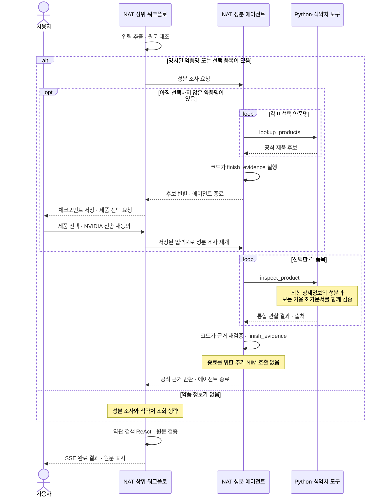

# 개발 및 검증

프로젝트 개요는 [README](../README.md), 설치와 API 키 발급은 [실행 안내](setup.md)를 참고하세요. 아래 명령은 프로젝트 루트에서 실행합니다.

## 조건부 성분 근거 에이전트

다음은 모델이 선택하는 작업과 코드가 종료하는 지점을 구분한 실행 흐름입니다.



제품 후보가 없으면 미확인 상태를 표시하고, 조회·검증 오류가 발생하면 실패로 처리합니다. 위 재개 경로는 사용자가 선택·동의했을 때만 실행하며 완료된 입력 추출과 후보 조회를 반복하지 않습니다. **코드의 자동 종료는 성분 에이전트에 적용됩니다.** 약관 검색은 계속 모델의 검색·문맥 조회·종료 도구 선택을 사용하는 자체 ReAct 루프입니다.

NAT 워크플로 안에 `drug_evidence_agent`를 별도 함수로 등록하고 NVIDIA NAT의 내장 `tool_calling_agent`로 실행합니다. `nvidia-nat[langchain]` 의존성은 `uv sync --extra dev`로 함께 설치됩니다. 모델은 기존 NeMo Microservices SDK의 Nemotron 연결을 사용하므로 추가 키는 필요하지 않습니다.

- 사용자가 명시한 약품명이 입력 확인 단계에서 추출되거나, 사용자가 공식 품목을 선택한 경우에만 호출합니다. 약품명은 현재 입력·확인 항목 또는 관련된 이전 사용자 발화에 근거해야 합니다. 약관에만 있는 약품명은 호출 근거가 아닙니다.
- 약품 정보 없는 사고 설명·질병 질문은 성분 에이전트와 식약처 호출을 건너뛰고 약관 검색으로 진행합니다. 이 경우 식약처 키도 요구하지 않습니다.
- 미선택 약품명은 제품 후보를 조회하고 사용자 선택을 기다립니다. 이미 선택한 품목은 성분과 원문 허가문서를 확인합니다. 후보를 모델이 대신 선택할 수 없습니다.
- 에이전트는 `drug-ingredient-resolver` 스킬 지침과 NAT `medicine` Function Group의 후보 조회 도구와 통합 성분 조사 도구(`inspect_product`)를 사용합니다. 통합 도구는 한 번 가져온 품목 상세 응답에서 성분과 사용 가능한 허가문서를 함께 검증하므로 중간 도구 선택을 위한 NIM 호출이 없습니다. 관찰 결과를 받은 뒤 다음 도구를 선택합니다. 모든 약품명의 후보 조회 또는 선택한 모든 품목의 성분·필수 허가문서 확인이 끝나면, 코드가 근거를 검증하고 NAT의 내부 종료 도구로 완료합니다. 종료 판단을 위한 추가 NIM 호출이나 답변 생성은 없습니다.
- 도구는 요청에 허용된 ID만 받고 중복 호출·필수 근거 누락을 차단합니다. 최대 12회 모델 단계, 기존 호출당 5분·재시도 1회·전체 20분 상한을 적용합니다. 성분명·원문·근거 연결은 코드가 검증하며 모델의 최종 문장은 사용하지 않습니다.

단일 약품 후보 조회는 모델 호출 1회이며, 허가문서가 있는 선택 품목의 성분 조사는 도구 통합으로 2회에서 1회로 줄어듭니다. 복수 품목은 품목마다 1회 조사하고, 모든 품목의 필수 근거 검증을 마친 뒤 코드가 종료합니다. 실패 시 부분 근거를 완료 상태로 기록하지 않습니다. 근거 확인 전의 모델·식약처 지연은 남아 있으며, 전체 응답 시간을 보장하는 변경은 아닙니다.

성분 조사는 NAT 내장 에이전트이며, 약관 검색은 현재 NAT 상위 워크플로 내부의 자체 ReAct 루프입니다. PDF 처리·원문 검증·주석 생성은 결정적인 Python 도구입니다. 콘솔에서 `agent.routed`의 `invoke`/`skip`, `agent.tool`, `agent.finalizing`, `agent.completed`로 분기와 실행 단계를 확인할 수 있습니다. 사용자 설명·약품명·허가문서 본문은 로그에 남기지 않습니다.

## 모듈과 실행 규약

입출력은 [contracts.md](contracts.md), 책임은 [module-definition.md](module-definition.md)에 정의합니다.

| Python 모듈 | 책임 |
|---|---|
| `concreteinsure/server.py`, `store.py` | 업로드·소유권·SQLite·작업 취소·재연결 가능한 SSE |
| `conversation.py` | 서버에 저장된 성공 대화와 원문을 제한된 길이의 모델 맥락으로 구성 |
| `providers.py` | 실제 `AsyncNeMoMicroservices` SDK 추론, 식약처 조회 |
| `nat.py` | 등록된 NAT workflow에서 Python 에이전트를 직접 실행 |
| `agent.py`, `agents/` | 명시 정보 추출 → 제품 근거 → ReAct 검색/문맥 → 보장 항목 연결 → 원문 검증 |
| `pdf.py`, `python/pdf_worker.py` | 제한 시간·취소가 있는 별도 프로세스, 문자 좌표 추적, 원문 검증, 표준 주석 |
| `skills_cli.py`, `skills/` | 성분 조회·PDF 처리 두 도구의 JSON CLI와 상위 원문 처리 `SKILL.md` 지침 |
| `public/` | 1:1 split PDF.js 화면 |

ReAct의 모델 출력은 허용된 도구와 ID를 고르는 데만 사용합니다. 자유롭게 생성한 최종 답변은 폐기하고, 애플리케이션이 PDF의 source span을 직접 반환합니다. 검색과 인용은 원문 언어로 처리합니다. 원문 계산·주석 같은 결정적인 작업에는 모델을 사용하지 않습니다. 의약품 근거는 식약처 구조화 성분 필드와 설명서의 명시적 문장에서만 추출합니다. 성분 연결 파서는 명시적인 전구약물→활성 대사물 전환 문장과 용법·용량의 성분 기준 표현(`성분명으로서/로서 + 용량`)을 지원합니다. 후자의 검색어는 해당 제품의 구조화 성분명에도 실제로 포함되어야 합니다. 효능·효과가 XML 제목 속성에 들어 있는 경우도 원문과 위치를 보존합니다. 용법·용량 인용은 성분 연결 근거이며 복용 안내가 아닙니다. 표현을 인식하지 못하면 염 이름을 임의로 지우거나 같은 성분이라고 추정하지 않습니다.

## 스킬과 테스트

웹의 성분 에이전트와 CLI 스킬은 같은 식약처 제공자와 원문 검증 모듈을 사용합니다. CLI는 개별 도구 어댑터이며 에이전트 실행 경로는 웹의 NAT 워크플로입니다. 웹이 매번 별도 CLI 프로세스를 실행하는 구조는 아닙니다. 두 도구 스킬은 `drug-ingredient-resolver`, `pdf-iso32000-annotator`이며 각 `SKILL.md`에 JSON 입출력과 사용법이 있습니다. 상위 원문 규칙은 `concrete-insure-source`입니다.

```sh
uv run --extra dev pytest -q
npm run test:browser
npm run test:browser:coverage
npm run test:browser:consent
npm run test:browser:progress
npm run test:browser:conversation
npm run test:browser:reset
npx skills@1.7.0 add . --list
# SkillSpector를 별도 설치한 경우:
sh scripts/scan-skills.sh
```

의약품·성분·허가문서의 정적 JSON은 `tests/fixtures/`에만 두며, 테스트 제공자(`tests/mfds_fixture.py`)가 주입하는 합성 응답으로만 사용합니다. 운영 서버·에이전트·스킬에서는 불러오지 않으며 키 누락이나 API 실패 시 대체 자료로 사용하지 않습니다.

브라우저 검사는 자체 임시 저장소와 합성 PDF를 사용합니다. 시스템 Chromium을 쓰려면 `BROWSER_EXECUTABLE`을 지정하세요. 없으면 `npx playwright install chromium`으로 설치합니다. [검증 기록](validation.md)에 실제 실행 결과와 미검증 기능을 구분합니다.

## 프로젝트 이름과 기존 설치 업데이트

| 구분 | 이름 |
|---|---|
| 서비스·화면 | `concreteInsure` |
| GitHub 저장소·패키지·서버 실행 명령 | `concrete-insure` |
| Python 모듈·NAT 진입점 | `concreteinsure` |
| 스킬 CLI | `concreteinsure-skill` |

이전 이름으로 설치한 작업 폴더에서는 서버를 종료한 뒤, 프로젝트 루트에 남은 자동 생성 메타데이터 `insure_lens.egg-info/` 폴더를 삭제하고 `uv sync --extra dev --locked`를 실행하세요. 오래된 NAT 진입점이 함께 검색되는 것을 방지합니다. 기존 `.env`를 유지한 채 `uv run concrete-insure`로 다시 시작합니다. 새로 복제한 저장소에는 이 정리가 필요하지 않습니다.
